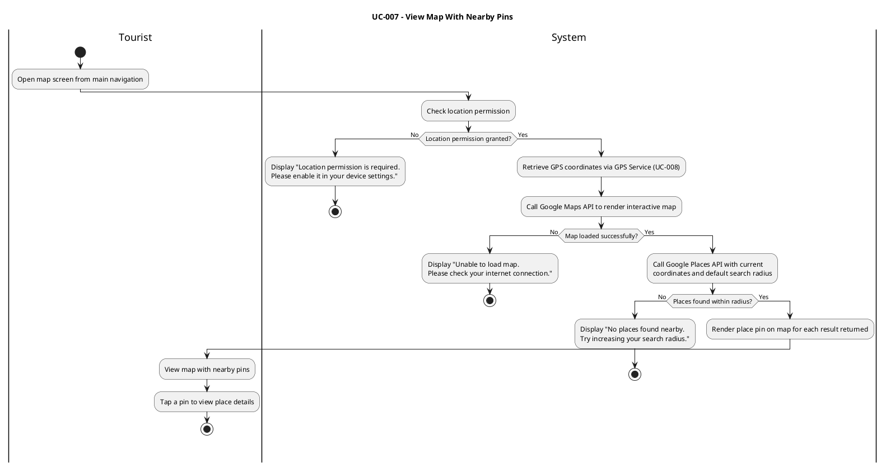
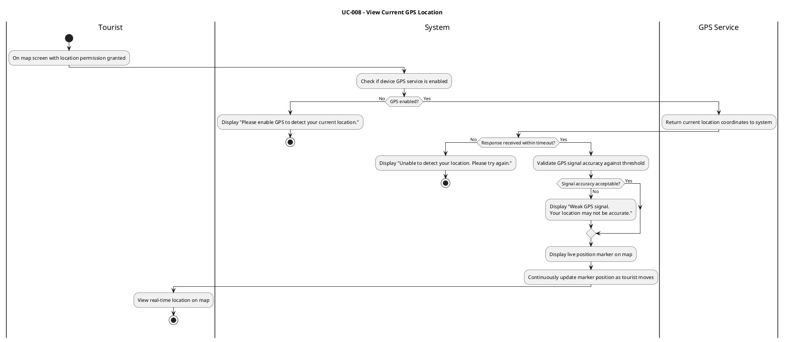
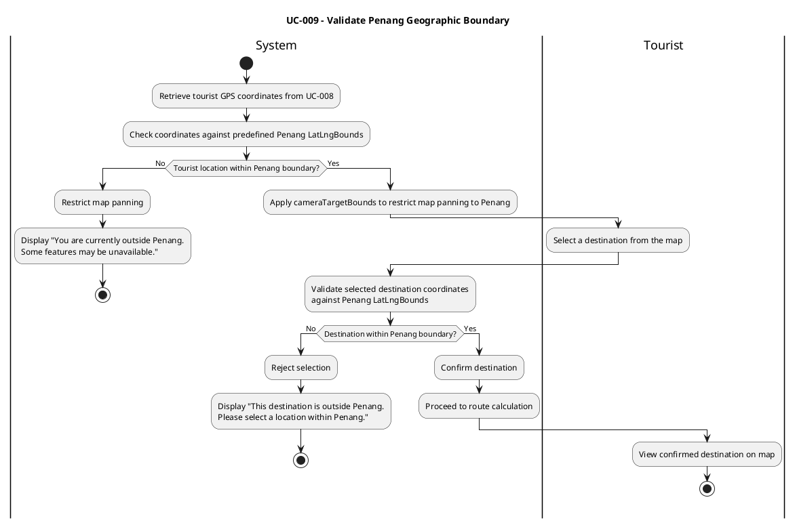
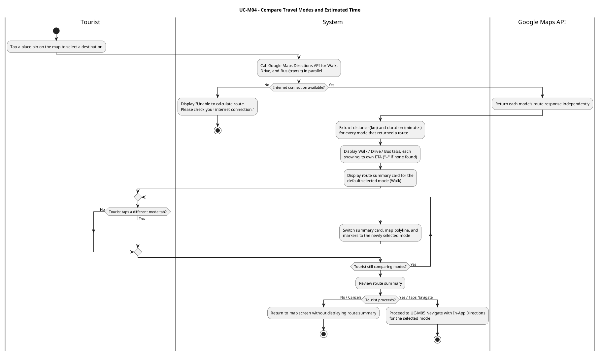
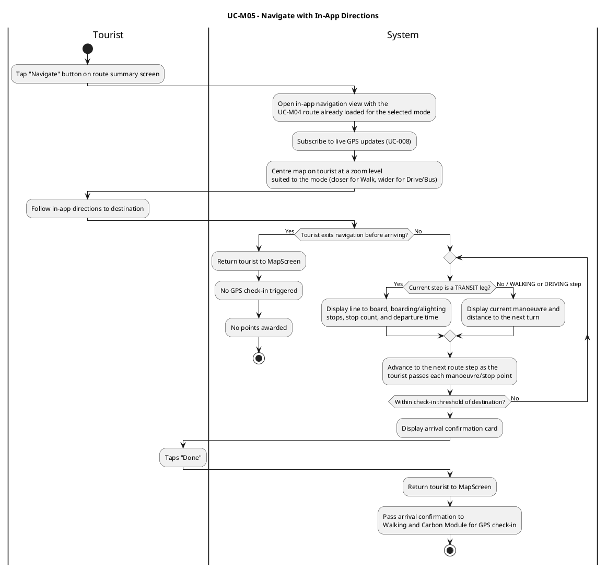

# Map & GPS Module — WalkPenang Mobile Application

**Module Owner:** Tang Yue Hann (2414352)
**Role:** Design Lead
**Course:** BMSE3004 Collaborative Development
**Group:** RSW1Y2S3, G4
**Tutor:** Muhammad Irsyad Bin Kamil Riadz

---

## Table of Contents

1. [Use Case Diagram](#1-use-case-diagram)
2. [Functional Requirements](#2-functional-requirements)
3. [Non-Functional Requirements](#3-non-functional-requirements)
4. [Requirements Completeness](#4-requirements-completeness)
5. [Use Case Descriptions](#5-use-case-descriptions)
6. [Activity Diagrams](#6-activity-diagrams)
7. [Component Breakdown](#7-component-breakdown)
8. [Product Backlog / User Stories](#8-product-backlog--user-stories)
9. [Sprint Backlog](#9-sprint-backlog)
10. [Task Allocation Summary](#10-task-allocation-summary)
11. [UI Mockups](#11-ui-mockups)

---

## 1. Use Case Diagram

The Map & GPS Module contains six use cases. Five are tourist-facing; **Request Map Service** is a system-level use case with no direct tourist interaction, serving as the shared backend layer for calls to the Google Maps API.

| Use Case ID | Use Case Name | Actor |
|---|---|---|
| UC-007 | View Map With Nearby Pins | User |
| UC-008 | View Current GPS Location | GPS Service |
| UC-009 | Validate Penang Geographic Boundary | System |
| UC-M04 | Compare Travel Modes and Estimated Time | User |
| UC-M05 | Navigate with In-App Directions | User |
| UC-M06 | Request Map Service | «System» Google Maps API |

**Relationships:**
- UC-007 «include» UC-008
- UC-008 «include» UC-009
- UC-M04 «extends» UC-M06 — fetches Walk, Drive, and Bus (transit) routes in parallel so the tourist can compare them before picking one
- UC-M05 reuses whichever mode's route UC-M04 already fetched via UC-M06 — it does not call UC-M06 independently

**Note on scope:** Motorbike is intentionally not offered — Google's Directions API has no dedicated two-wheeler mode, only `driving`, `walking`, `bicycling`, and `transit`. Choosing a non-walking mode does not currently change GPS check-in or points logic (owned by the Walking & Carbon Module); that is left as an explicit trial to revisit once that module is built, per constraint C3 on UC-M05.

---

## 2. Functional Requirements

**Table 1.3: Functional Requirements for Map & GPS Module (Tang Yue Hann)**

| FR ID | Requirement | Description |
|---|---|---|
| FR-M01 | Display Interactive Map | The system shall display a Google Maps interface centred on the user's current location, with nearby place pins rendered within the selected search radius. |
| FR-M02 | Detect User GPS Location | The system shall detect and continuously update the user's real-time GPS coordinates using the Flutter Geolocator package. |
| FR-M03 | Compare Travel Time Across Modes | The system shall calculate and display the estimated distance and time from the user's current location to a selected destination for Walking, Driving, and Bus (transit) modes, using the Google Maps Directions API, so the user can compare them before choosing one. |
| FR-M04 | In-App Multi-Modal Navigation | The system shall provide live turn-by-turn navigation — for whichever of Walking, Driving, or Bus (transit) the user selected — rendered entirely within the application's own map, without handing off to an external navigation app. Bus navigation additionally shows the line to board, the stop to alight at, and the departure time for each transit leg. |
| FR-M05 | Restrict Map to Penang Boundary | The system shall restrict all map exploration and place discovery features to within the geographic boundaries of Penang State, preventing results from being returned outside this area. |

---

## 3. Non-Functional Requirements

**Table 2.1: Non-Functional Requirements for WalkPenang Mobile Application**

| NFR ID | Quality | Requirement | Description |
|---|---|---|---|
| NFR-01 | Performance | Map Loading Speed | The map interface shall fully load and display nearby place pins within 3 seconds on a standard 4G mobile connection. |
| NFR-02 | Reliability | GPS Check-In Reliability | The GPS check-in function shall use the user's current GPS coordinates to verify whether the user is within 100 metres of the selected destination under normal network, GPS, and hardware conditions. |
| NFR-03 | Usability | Ease of Use | First-time users shall be able to complete core tasks within 3 taps from the home screen, without requiring a tutorial. |
| NFR-04 | Security | Data Protection | All user data shall be secured through Firebase Authentication and Firestore security rules. |
| NFR-05 | Scalability | Concurrent Users | The Firebase backend shall support a minimum of 1,000 concurrent users without performance degradation. |
| NFR-06 | Compatibility | Platform Support | The application shall run on Android devices with Android 8.0 (API Level 26) and above. |
| NFR-07 | Maintainability | Modular Codebase | The application shall be developed using a modular Flutter architecture, allowing individual modules to be updated independently. |
| NFR-08 | Availability | System Uptime | Firebase backend services shall maintain a minimum uptime of 99.5% throughout the VM2026 campaign period. |

---

## 4. Requirements Completeness

### 4.1 Traceability Matrix

**Table X.X: Requirements Traceability Matrix — Map & GPS Module**

| Use Case ID | Use Case Name | FR ID | Related NFR IDs |
|---|---|---|---|
| UC-007 | View Map With Nearby Pins | FR-M01 | NFR-01, NFR-03, NFR-06 |
| UC-007 | View Map With Nearby Pins | FR-M05 | NFR-02, NFR-06 |
| UC-008 | View Current GPS Location | FR-M02 | NFR-02, NFR-04 |
| UC-M04 | Compare Travel Modes and Estimated Time | FR-M03 | NFR-01, NFR-03 |
| UC-M05 | Navigate with In-App Directions | FR-M04 | NFR-03, NFR-06 |

### 4.2 Completeness Checklist

**Table X.X: Functional Requirements Completeness Checklist**

| FR ID | Complete | Unambiguous | Consistent | Testable | Traceable |
|---|:---:|:---:|:---:|:---:|:---:|
| FR-M01 | ✓ | ✓ | ✓ | ✓ | ✓ |
| FR-M02 | ✓ | ✓ | ✓ | ✓ | ✓ |
| FR-M03 | ✓ | ✓ | ✓ | ✓ | ✓ |
| FR-M04 | ✓ | ✓ | ✓ | ✓ | ✓ |
| FR-M05 | ✓ | ✓ | ✓ | ✓ | ✓ |

---

## 5. Use Case Descriptions

### UC-007: View Map With Nearby Pins

| Element | Description |
|---|---|
| **Brief Description** | The system displays an interactive Google Maps interface centred on the tourist's current GPS location, with nearby food establishment and tourist attraction pins rendered within the selected search radius. |
| **Preconditions** | Tourist has opened the WalkPenang application and navigated to the map screen. Tourist has granted location permission to the application. |
| **Postconditions** | Tourist views the interactive map with nearby place pins displayed within the selected radius. |

**Basic Flow**

| Step | Tourist | System Response |
|---|---|---|
| 1 | Opens the map screen from the main navigation | |
| 2 | | Requests location permission if not already granted [A1] |
| 3 | | Retrieves current GPS coordinates via UC-008 |
| 4 | | Calls Google Places API to fetch nearby results [A2] |
| 5 | | Renders the interactive map centred on the tourist's location [A3] |
| 6 | | Renders a place pin for each result returned |
| 7 | Views map and taps a pin for details | |

**Alternative Flow**

| Flow | Description |
|---|---|
| A1: Location permission denied | System displays "Location permission is required. Please enable it in your device settings." Use case ends. |
| A2: No nearby places found | System displays "No places found nearby. Try increasing your search radius." Use case ends. |
| A3: Map fails to load | System displays "Unable to load map. Please check your internet connection." Use case ends. |

**Constraints**
- C1: Place pins are limited to food establishments and tourist attractions within the selected search radius (1 km, 2 km, or 5 km)
- C2: Map display is restricted to the Penang geographic boundary at all times

---

### UC-008: View Current GPS Location

| Element | Description |
|---|---|
| **Brief Description** | The system detects and displays the tourist's real-time GPS coordinates on the map as a live position marker, continuously updated as the tourist moves. This use case includes UC-009. |
| **Preconditions** | Tourist has granted location permission. Device GPS service is enabled. Tourist is on the map screen (UC-007). |
| **Postconditions** | Tourist's current GPS location is displayed and passed to UC-009 for boundary validation. |

**Basic Flow**

| Step | Tourist | System Response |
|---|---|---|
| 1 | On the map screen with location permission granted | |
| 2 | | Requests GPS coordinates from device [A1] |
| 3 | | GPS service returns coordinates [A3] |
| 4 | | Validates GPS signal accuracy [A2] |
| 5 | | Passes coordinates to UC-009 |
| 6 | | Displays live position marker |
| 7 | | Continuously updates marker as tourist moves |
| 8 | Views real-time location on map | |

**Alternative Flow**

| Flow | Description |
|---|---|
| A1: GPS disabled on device | System displays "Please enable GPS to detect your current location." Use case ends. |
| A2: GPS signal too weak | System displays "Weak GPS signal. Your location may not be accurate." and continues with available reading. |
| A3: Location request times out | System displays "Unable to detect your location. Please try again." Use case ends. |

**Constraints**
- C1: GPS coordinates retrieved via Flutter Geolocator package
- C2: Location updates continuously in real time while map screen is active

---

### UC-009: Validate Penang Geographic Boundary

| Element | Description |
|---|---|
| **Brief Description** | The system automatically validates that the tourist's GPS location and all selected destinations fall within the defined Penang geographic boundary. Included by UC-008. |
| **Preconditions** | Tourist's GPS coordinates retrieved by UC-008. Penang boundary defined as a LatLngBounds object. |
| **Postconditions** | All map content and destinations confirmed within Penang's boundary. |

**Basic Flow**

| Step | Tourist | System Response |
|---|---|---|
| 1 | | Receives GPS coordinates from UC-008 |
| 2 | | Checks coordinates against Penang LatLngBounds [A1] |
| 3 | | Applies cameraTargetBounds to restrict map panning |
| 4 | Selects a destination from the map | |
| 5 | | Validates destination is within Penang boundary [A2] |
| 6 | | Confirms destination and proceeds to route calculation |

**Alternative Flow**

| Flow | Description |
|---|---|
| A1: User location outside Penang boundary | System restricts map panning and displays "You are currently outside Penang. Some features may be unavailable." Use case ends. |
| A2: Selected destination outside Penang boundary | System rejects selection and displays "This destination is outside Penang. Please select a location within Penang." Use case ends. |

**Constraints**
- C1: Penang boundary coordinates defined as a fixed LatLngBounds constant
- C2: Boundary validation applies to both current location and all selected destinations

---

### UC-M04: Compare Travel Modes and Estimated Time

| Element | Description |
|---|---|
| **Brief Description** | The system calculates and displays the estimated distance and time to a selected destination for Walking, Driving, and Bus (transit), fetched together so the tourist can compare them on a set of mode tabs before choosing one. Extends UC-M06 (Request Map Service). |
| **Preconditions** | Destination selected and passed boundary validation (UC-009). Device connected to internet. |
| **Postconditions** | Tourist views estimated distance and time for the selected mode on a route summary card, with the other modes' ETAs available on the tabs above it. |

**Basic Flow**

| Step | Tourist | System Response |
|---|---|---|
| 1 | Taps a place pin to select a destination | |
| 2 | | Triggers UC-M06 to call the Directions API for Walking, Driving, and Bus in parallel [A2] |
| 3 | | Receives each mode's route response from UC-M06 independently [A1] |
| 4 | | Extracts distance and duration for every mode that returned a route |
| 5 | | Displays the mode tabs (Walk / Drive / Bus), each showing its own ETA, and the route summary card for the default selected mode (Walk) |
| 6 | Taps a different mode tab [A4] | |
| 7 | | Switches the route summary card, map polyline, and markers to the newly selected mode — no repeated API call |
| 8 | Reviews route summary | |
| 9 | Taps "Navigate" or cancels [A3] | |

**Alternative Flow**

| Flow | Description |
|---|---|
| A1: No route available for a mode | That mode's tab shows "--" instead of an ETA; tapping it (or the initially selected mode having no route) displays "No route found for this travel mode. Try a different mode or destination." Other modes with a valid route remain selectable. |
| A2: Network connection lost during route calculation | System displays "Unable to calculate route. Please check your internet connection." for whichever mode failed. Use case ends if every mode fails. |
| A3: Tourist cancels destination selection | System returns to the map screen without displaying any route summary. Use case ends. |
| A4: Tourist switches modes after already viewing one | System re-displays the summary card and "Navigate" button state (disabled if the newly selected mode has no route) using the already-fetched result — no loading state is shown. |

**Constraints**
- C1: Distance in km, time in minutes (formatted as "Xh Ym" past one hour), from the Google Maps Directions API via UC-M06
- C2: Carbon and calorie data calculated separately by the Walking and Carbon Module, and only for the Walking mode
- C3: Motorbike is not offered as a mode — the Directions API has no dedicated two-wheeler mode

---

### UC-M05: Navigate with In-App Directions

| Element | Description |
|---|---|
| **Brief Description** | The system renders live turn-by-turn directions on WalkPenang's own map for whichever mode the tourist selected in UC-M04 (Walk, Drive, or Bus), following the tourist's GPS position along the already-calculated route — no hand-off to an external navigation app. Bus routes additionally surface which line to board and where to alight. |
| **Preconditions** | Tourist reviewed route summary from UC-M04 and selected a mode with a valid route. Location permission granted (UC-008). |
| **Postconditions** | Tourist is actively following in-app turn-by-turn directions towards the destination for the selected mode. |

**Basic Flow**

| Step | Tourist | System Response |
|---|---|---|
| 1 | Taps "Navigate" on route summary | |
| 2 | | Opens the in-app navigation view with the UC-M04 route already loaded for the selected mode |
| 3 | | Subscribes to live GPS updates (UC-008) and centres the map on the tourist, at a zoom level suited to the mode (closer for Walk, wider for Drive/Bus) |
| 4 | | Replaces the default location dot with a directional puck marker, rotated to the tourist's live GPS course over ground and moved on every location update |
| 5 | | For a `WALKING`/`DRIVING` step, displays the current manoeuvre and distance to the next turn; for a `TRANSIT` step [A5], displays the line to board, the boarding/alighting stops, stop count, and departure time instead |
| 6 | Follows the in-app directions to the destination [A1] | |
| 7 | | Advances through route steps as the tourist passes each one, mixing walking and transit steps in sequence for a Bus route |
| 8 | | Detects arrival once within the check-in threshold of the destination [A2] |
| 9 | | Returns tourist to map screen, passes arrival confirmation to Walking and Carbon Module |

**Alternative Flow**

| Flow | Description |
|---|---|
| A1: Tourist exits navigation early | System returns tourist to map screen without triggering GPS check-in or awarding points. Use case ends. |
| A2: Tourist arrives at destination | System shows an arrival confirmation card; tapping "Done" returns to the map screen and hands off to the Walking and Carbon Module. |
| A3: Tourist pans the map away from their position | The camera stops auto-following; a recentre button appears (filled while following, outlined once panned away) that snaps the camera back and resumes auto-follow when tapped. |
| A4: Tourist zooms in or out manually | On-screen `+`/`−` zoom controls are available at all times, independent of auto-follow. |
| A5: Current step is a transit leg | The instruction banner swaps its icon to the vehicle type (bus/train/tram/ferry) and its text to "Board {line} · {from} → {to} · N stops", with the departure time shown beneath. |

**Constraints**
- C1: Turn-by-turn instructions come from the Directions API response already fetched for UC-M04 (UC-M06) for the selected mode — no repeated API calls during navigation
- C2: GPS check-in and points awarding handled by the Walking and Carbon Module upon confirmed arrival
- C3: Non-walking modes do not currently gate or affect check-in/points — this is an explicit interim choice (to be revisited once the Walking & Carbon Module exists) rather than a considered design decision

---

### UC-M06: Request Map Service

| Element | Description |
|---|---|
| **Brief Description** | Handles all outbound calls to the Google Maps API on behalf of other use cases. Extended by UC-M04; UC-M05 reuses UC-M04's result rather than calling this use case again. |
| **Preconditions** | A request triggered by UC-M04. Device connected to internet. Google Maps API key configured. |
| **Postconditions** | Google Maps API returns requested data to the calling use case. |

**Basic Flow**

| Step | System Response |
|---|---|
| 1 | Receives a map service request from UC-M04 |
| 2 | Constructs the appropriate API request |
| 3 | Sends the request to Google Maps API [A1] |
| 4 | Google Maps API returns the response [A2] |
| 5 | Passes response data back to the calling use case |

**Alternative Flow**

| Flow | Description |
|---|---|
| A1: API request fails | System notifies calling use case of failure; the calling use case displays the appropriate error message. Use case ends. |
| A2: API returns empty response | System passes empty response to calling use case, which handles the empty state accordingly. Use case ends. |

**Constraints**
- C1: All Google Maps API calls require a valid API key configured in AndroidManifest.xml
- C2: This use case does not interact with the tourist directly, it serves only as a shared service layer

---

## 6. Activity Diagrams

PlantUML source code for each use case activity diagram.

### UC-007 — View Map With Nearby Pins



### UC-008 — View Current GPS Location



### UC-009 — Validate Penang Geographic Boundary



### UC-M04 — Compare Travel Modes and Estimated Time



### UC-M05 — Navigate with In-App Directions



---

## 7. Component Breakdown

**Table X.X: Component Breakdown — Map & GPS Module (Tang Yue Hann)**

| No. | Sub Module | Description | Functions |
|---|---|---|---|
| 1 | Map Display Sub Module | Renders the Google Maps interface centred on the tourist's location, places nearby food and attraction pins within the selected radius, keeps the map within Penang, and provides on-screen zoom controls shared by the map, route summary, and navigation screens. | `loadMap()` `centreMapOnLocation()` `renderNearbyPins()` `setSearchRadius()` `applyBoundaryConstraint()` `zoomIn()` `zoomOut()` |
| 2 | GPS Location Sub Module | Retrieves the tourist's GPS coordinates via the Flutter Geolocator package, requests location permission on startup, and updates the live position marker as the tourist moves. | `requestLocationPermission()` `getCurrentLocation()` `updateLocationMarker()` `startLocationUpdates()` `checkSignalAccuracy()` |
| 3 | Boundary Validation Sub Module | Checks the tourist's location and selected destinations against the Penang LatLngBounds, blocks out of boundary map panning, and rejects invalid destination selections. | `validateUserLocation()` `validateDestination()` `restrictMapPanning()` `showOutOfBoundaryMessage()` |
| 4 | Route Calculation Sub Module | Calls the Google Maps Directions API for Walk, Drive, and Bus (transit) in parallel, reads distance/duration/turn-by-turn steps (including transit line/stop details) from each response, and displays a mode-comparison route summary card below the map. | `calculateRoute()` `extractDistanceAndDuration()` `displayRouteSummaryCard()` `handleNoRouteFound()` |
| 5 | In-App Navigation Sub Module | Drives live turn-by-turn directions on WalkPenang's own map, for whichever mode was selected, from the route already calculated in the Route Calculation sub module — advances through route steps (walking manoeuvres or transit legs) and detects arrival from the live GPS stream, without opening an external app. | `distanceToStepEnd()` `advanceStepIndex()` `hasArrived()` |
| 6 | Map Service Sub Module | Shared layer for Google Maps API calls made by the Route Calculation sub module, parameterised by travel mode (`walking` / `driving` / `transit`). Builds each request, gets the response, and returns the result to the calling sub module. | `sendAPIRequest()` `handleAPIResponse()` `handleAPIError()` `buildDirectionsRequest()` |

---

## 8. Product Backlog / User Stories

**Table 3.3: Product Backlog for Map & GPS Module (Tang Yue Hann)**

| ID | Affect | Description (User Story) | Tasks | Story Point | Difficulty |
|---|---|---|---|:---:|:---:|
| US-M01 | Map & GPS Module, User Interface | As a tourist, I want to see nearby food places and attractions on an interactive map so I can decide where to walk next without leaving the app. | 1. Add `google_maps_flutter`, configure API key in AndroidManifest.xml 2. Build MapScreen centred on George Town 3. Render Google Places results as map pins 4. Show "No places found nearby" if list is empty | 8 | High |
| US-M02 | Map & GPS Module, User Interface | As a tourist, I want my real-time GPS location shown on the map so I always know where I am in Penang. | 1. Add geolocator, request location permission on load 2. Display live position marker using myLocationEnabled: true 3. Show "Please enable GPS" if location service is off | 5 | Medium |
| US-M03 | Map & GPS Module, Food & Attraction Discovery Module | As the system, I want to restrict all map content to within Penang's boundary so only relevant destinations are shown. | 1. Define Penang LatLngBounds in constants file 2. Apply cameraTargetBounds to restrict map panning 3. Show "This destination is outside Penang" for invalid selections | 3 | Medium |
| US-M04 | Map & GPS Module, Walking & Carbon Module | As a tourist, I want to compare walking, driving, and bus travel time to a destination so I can decide how to get there. | 1. Call Google Maps Directions API for Walk/Drive/Bus in parallel 2. Build Walk / Drive / Bus mode tabs, each showing its own ETA 3. Extract distance and duration, display on route summary card for the selected mode 4. Show "No route found for this travel mode" per-tab if a mode returns no result | 8 | High |
| US-M05 | Map & GPS Module, User Interface | As a tourist, I want live turn-by-turn directions inside the app for whichever mode I picked — including which bus to board — so I do not need to switch to a separate navigation tool. | 1. Build NavigationView with a follow-camera GoogleMap and instruction banner 2. Advance through route steps and detect arrival from the live GPS stream 3. Add a transit-aware instruction card (vehicle icon, line, boarding/alighting stops, departure time) for `TRANSIT` steps 4. Add "Navigate" button on route summary screen; return tourist to MapScreen on exit without triggering check-in | 8 | High |

---

## 9. Sprint Backlog

**Table X.X: Sprint Backlog for Map & GPS Module (Tang Yue Hann)**

| Sprint | Story ID | Task ID | Task Description | Assigned To | Est. Hours | Priority | Status |
|:---:|:---:|:---:|---|---|:---:|:---:|:---:|
| 2 | US-M01 | T-M01.1 | Add google_maps_flutter, configure API key, build MapScreen centred on George Town | Tang Yue Hann | 4 | Must Have | Not Started |
| 2 | US-M01 | T-M01.2 | Call Google Places API and render nearby results as map pins | Tang Yue Hann | 4 | Must Have | Not Started |
| 2 | US-M01 | T-M01.3 | Test map rendering and empty state handling across different radii | Tang Yue Hann | 2 | Should Have | Not Started |
| 2 | US-M02 | T-M02.1 | Add geolocator, request location permission, display live position marker | Tang Yue Hann | 4 | Must Have | Not Started |
| 2 | US-M02 | T-M02.2 | Handle GPS disabled and weak signal accuracy warnings | Tang Yue Hann | 2 | Should Have | Not Started |
| 2 | US-M02 | T-M02.3 | Test live location updates while moving on the map screen | Tang Yue Hann | 2 | Must Have | Not Started |
| 3 | US-M03 | T-M03.1 | Define Penang LatLngBounds and apply cameraTargetBounds | Tang Yue Hann | 3 | Must Have | Not Started |
| 3 | US-M03 | T-M03.2 | Validate destination coordinates and show out of boundary error message | Tang Yue Hann | 3 | Must Have | Not Started |
| 3 | US-M03 | T-M03.3 | Test boundary validation with coordinates inside and outside Penang | Tang Yue Hann | 2 | Should Have | Not Started |
| 3 | US-M04 | T-M04.1 | Call Google Maps Directions API in walking mode, extract distance and duration | Tang Yue Hann | 4 | Must Have | Not Started |
| 3 | US-M04 | T-M04.2 | Display route summary card, handle no route found or lost connection errors | Tang Yue Hann | 3 | Should Have | Not Started |
| 3 | US-M04 | T-M04.3 | Test route calculation accuracy across multiple destinations | Tang Yue Hann | 2 | Must Have | Not Started |
| 3 | US-M04 | T-M04.4 | Generalise Directions call to Drive/Bus, fetch all three modes in parallel, build mode-comparison tabs | Tang Yue Hann | 4 | Must Have | Not Started |
| 4 | US-M05 | T-M05.1 | Build NavigationController (step advancement, arrival detection) and NavigationView with a follow-camera GoogleMap | Tang Yue Hann | 5 | Must Have | Not Started |
| 4 | US-M05 | T-M05.2 | Add instruction banner, remaining distance/ETA bar, and arrival confirmation card | Tang Yue Hann | 4 | Should Have | Not Started |
| 4 | US-M05 | T-M05.3 | Test in-app navigation and exit flow, returning to MapScreen without triggering check in | Tang Yue Hann | 3 | Must Have | Not Started |
| 4 | US-M05 | T-M05.4 | Parse transit steps (line, stops, departure time), add transit-aware instruction card and mode-based navigation zoom | Tang Yue Hann | 4 | Must Have | Not Started |

**Sprint Summary**

| Sprint | Duration | User Stories | Total Est. Hours |
|:---:|---|---|:---:|
| Sprint 2 | Week 8 – Week 9 | US-M01, US-M02 | 18 |
| Sprint 3 | Week 9 – Week 10 | US-M03, US-M04 | 21 |
| Sprint 4 | Week 10 | US-M05 | 16 |
| **Total** | **3 weeks** | **5 stories** | **55** |

---

## 10. Task Allocation Summary

**Table X.X: Task Allocation Summary for Map & GPS Module (Tang Yue Hann)**

| Sprint | Duration | User Stories | Story Points | Est. Hours | Primary Owner | Supporting Member | Sprint Deliverable |
|:---:|:---:|:---:|:---:|:---:|---|---|---|
| 2 | Week 8 – Week 9 | US-M01, US-M02 | 10 | 18 | Tang Yue Hann | Ong Song Wei (place data handoff) | Interactive map with live GPS location and nearby place pins |
| 3 | Week 9 – Week 10 | US-M03, US-M04 | 11 | 21 | Tang Yue Hann | — | Penang boundary validation and Walk/Drive/Bus route comparison with distance and time |
| 4 | Week 10 | US-M05 | 8 | 16 | Tang Yue Hann | Poon Wei Seng (check in trigger) | Live in-app turn-by-turn navigation (walk/drive/transit) with return to app flow |
| **Total** | **3 weeks** | **5 stories** | **32** | **55** | | | |

---

## 11. UI Mockups

Figma prototype link: **https://www.figma.com/design/sYfsMDHjHntVTV0SIqAtKa**

| Screen | Use Case | Description |
|---|---|---|
| UC-007 | View Map With Nearby Pins | Map with nearby pins, radius chips, places list |
| UC-008 | View Current GPS Location | GPS live location marker, coordinates card, boundary confirmation |
| UC-009 | Validate Penang Geographic Boundary | Penang boundary box, rejected out-of-boundary pin, error banner |
| UC-M04 | Compare Travel Modes and Estimated Time | Walk / Drive / Bus mode tabs with per-mode ETA, route line, distance and time cards, Navigate and Cancel buttons |
| UC-M05 | Navigate with In-App Directions | Dark in-app navigation mode, turn-by-turn instruction banner (or transit board/alight card for bus legs), remaining distance/ETA bar, recentre and zoom controls, arrival confirmation card |

**Design tokens used:**

| Token | Value |
|---|---|
| Primary | `#E4B592` |
| Background | `#FFF3EA` |
| Surface | `#000000` |
| On-primary | `#111111` |
| Border | `#FFFFFF` |
| Radius SM | 10 |
| Radius MD | 50 |

---

## 12. Implementation Specification

This section gives Claude Code (or any developer) the concrete details needed to actually build the module, on top of the design and requirements above.

### 12.1 Package Dependencies

Add the following to `pubspec.yaml`. Versions are pinned to stable releases compatible with Flutter 3.x as of early 2026; check `flutter pub outdated` before installing in case newer stable versions exist.

```yaml
dependencies:
  flutter:
    sdk: flutter
  google_maps_flutter: ^2.9.0
  geolocator: ^13.0.1
  geolocator_android: ^4.6.1
  http: ^1.2.2
  provider: ^6.1.2
  cloud_firestore: ^5.4.4
  firebase_core: ^3.6.0
```

### 12.2 State Management Approach

This module uses **Provider** for state management, consistent with the rest of the WalkPenang app. Each screen has a corresponding `ChangeNotifier` class that holds its state and business logic, keeping widgets focused purely on layout.

```dart
class MapViewModel extends ChangeNotifier {
  LatLng? currentLocation;
  List<PlaceModel> nearbyPlaces = [];
  bool isLoading = false;
  String? errorMessage;

  Future<void> loadNearbyPlaces() async {
    isLoading = true;
    notifyListeners();
    // fetch logic here
    isLoading = false;
    notifyListeners();
  }
}
```

Each screen wraps its widget tree with `ChangeNotifierProvider`, and widgets read state via `context.watch<MapViewModel>()` or `context.read<MapViewModel>()` for actions.

### 12.3 Data Models

**`lib/models/place_model.dart`**

```dart
class PlaceModel {
  final String placeId;
  final String name;
  final String category; // 'food' | 'heritage' | 'nature'
  final double latitude;
  final double longitude;
  final double? rating;
  final String? photoUrl;
  final String? address;
  final bool isOpenNow;

  PlaceModel({
    required this.placeId,
    required this.name,
    required this.category,
    required this.latitude,
    required this.longitude,
    this.rating,
    this.photoUrl,
    this.address,
    this.isOpenNow = false,
  });

  factory PlaceModel.fromJson(Map<String, dynamic> json) {
    return PlaceModel(
      placeId: json['place_id'],
      name: json['name'],
      category: json['category'],
      latitude: json['geometry']['location']['lat'],
      longitude: json['geometry']['location']['lng'],
      rating: json['rating']?.toDouble(),
      photoUrl: json['photo_url'],
      address: json['vicinity'],
      isOpenNow: json['opening_hours']?['open_now'] ?? false,
    );
  }
}
```

**`lib/models/route_result.dart`**

```dart
class RouteResult {
  final double distanceKm;
  final int durationMinutes;
  final List<LatLng> polylinePoints;
  final List<RouteStep> steps;
  final bool routeFound;

  RouteResult({
    required this.distanceKm,
    required this.durationMinutes,
    required this.polylinePoints,
    this.steps = const [],
    this.routeFound = true,
  });

  factory RouteResult.notFound() => RouteResult(
        distanceKm: 0,
        durationMinutes: 0,
        polylinePoints: [],
        steps: [],
        routeFound: false,
      );
}
```

**`lib/models/route_step.dart`** — one Directions API leg step; a transit
route mixes `WALKING` and `TRANSIT` steps in sequence.

```dart
class RouteStep {
  final String instruction;
  final String maneuver;
  final double distanceMeters;
  final int durationSeconds;
  final LatLng startLocation;
  final LatLng endLocation;
  final List<LatLng> polylinePoints;
  final String travelMode; // 'WALKING' | 'DRIVING' | 'TRANSIT'
  final TransitDetails? transitDetails; // non-null only when travelMode == 'TRANSIT'

  RouteStep({
    required this.instruction,
    required this.maneuver,
    required this.distanceMeters,
    required this.durationSeconds,
    required this.startLocation,
    required this.endLocation,
    required this.polylinePoints,
    this.travelMode = 'WALKING',
    this.transitDetails,
  });
}
```

**`lib/models/transit_details.dart`** — parsed from a `TRANSIT` step's
`transit_details` object.

```dart
class TransitDetails {
  final String lineName;
  final String vehicleType; // BUS, SUBWAY, TRAM, RAIL, FERRY, ...
  final String headsign;
  final String departureStopName;
  final String arrivalStopName;
  final int numStops;
  final String departureTimeText;
  final String arrivalTimeText;

  TransitDetails({
    required this.lineName,
    required this.vehicleType,
    required this.headsign,
    required this.departureStopName,
    required this.arrivalStopName,
    required this.numStops,
    required this.departureTimeText,
    required this.arrivalTimeText,
  });
}
```

**`lib/constants/travel_mode.dart`** — the three modes UC-M04 compares and
UC-M05 navigates. Motorbike is deliberately excluded (see Section 1).

```dart
enum TravelMode { walking, driving, transit }

extension TravelModeApi on TravelMode {
  String get apiValue { /* 'walking' | 'driving' | 'transit' */ }
  String get label { /* 'Walk' | 'Drive' | 'Bus' */ }
}
```

**`lib/models/gps_location.dart`**

```dart
class GpsLocation {
  final double latitude;
  final double longitude;
  final double accuracyMeters;
  final DateTime timestamp;

  GpsLocation({
    required this.latitude,
    required this.longitude,
    required this.accuracyMeters,
    required this.timestamp,
  });

  bool get isAccurate => accuracyMeters <= 20;
}
```

### 12.4 Constants File

**`lib/constants/map_constants.dart`**

```dart
import 'package:google_maps_flutter/google_maps_flutter.dart';

class MapConstants {
  // Penang geographic boundary (approximate bounding box)
  static const LatLngBounds penangBounds = LatLngBounds(
    southwest: LatLng(5.2350, 100.1500),
    northeast: LatLng(5.5900, 100.5500),
  );

  static const LatLng georgeTownCenter = LatLng(5.4141, 100.3288);

  static const double defaultSearchRadiusKm = 2.0;
  static const double checkInThresholdMeters = 100.0;
  static const double defaultZoom = 14.0;

  static const List<double> radiusOptions = [1.0, 2.0, 5.0];
}
```

### 12.5 API Key Configuration

Do **not** hardcode the Google Maps API key in Dart files. Add it to the native Android manifest instead.

**`android/app/src/main/AndroidManifest.xml`**

```xml
<application>
    <meta-data
        android:name="com.google.android.geo.API_KEY"
        android:value="YOUR_GOOGLE_MAPS_API_KEY_HERE" />
</application>
```

For the Directions and Places API calls made from Dart, store the key in a `.env` file (excluded via `.gitignore`) and load it with the `flutter_dotenv` package, or pass it through `--dart-define` at build time:

```bash
flutter run --dart-define=MAPS_API_KEY=your_key_here
```

### 12.6 File and Folder Structure

```
lib/
├── models/
│   ├── place_model.dart
│   ├── route_result.dart
│   ├── route_step.dart                  # UC-M05 turn-by-turn step (mixes WALKING/TRANSIT for a bus route)
│   ├── transit_details.dart             # UC-M05 transit leg (line, stops, departure time)
│   └── gps_location.dart
├── screens/
│   └── map/
│       ├── map_screen.dart              # UC-007, UC-008
│       ├── route_summary_screen.dart    # UC-M04 (mode-comparison tabs + summary card)
│       └── navigation_screen.dart       # UC-M05 (in-app turn-by-turn, all modes)
├── widgets/
│   └── map/
│       ├── place_pin_marker.dart
│       ├── nearby_places_sheet.dart
│       ├── route_summary_card.dart
│       └── zoom_controls.dart           # shared +/- zoom control (map, summary, navigation screens)
├── services/
│   └── map/
│       ├── location_service.dart        # UC-008
│       ├── boundary_validator_service.dart  # UC-009
│       ├── route_service.dart           # UC-M04 (Walk/Drive/Bus Directions calls)
│       ├── navigation_service.dart      # UC-M05 (in-app step advancement / arrival)
│       └── map_service.dart             # UC-M06
├── viewmodels/
│   ├── map_view_model.dart
│   └── navigation_view_model.dart       # UC-M05 (live position/heading/step-index state)
├── utils/
│   └── duration_format.dart             # shared "20 min" / "1h 6m" ETA formatting
└── constants/
    ├── map_constants.dart
    └── travel_mode.dart                 # UC-M04/UC-M05 mode enum (walking/driving/transit)
```

### 12.7 Navigation / Routing

Named routes are used for screen transitions relevant to this module:

```dart
static const String mapScreenRoute = '/map';
static const String routeSummaryRoute = '/map/route-summary';

// Registered in MaterialApp routes:
routes: {
  mapScreenRoute: (context) => const MapScreen(),
  routeSummaryRoute: (context) => const RouteSummaryScreen(),
}
```

`MapScreen` pushes to `RouteSummaryScreen` with the selected `PlaceModel` passed as a constructor argument (not via route arguments, to keep type safety).

### 12.8 Error Message Reference

Centralising all user-facing strings from the alternative flows in one place keeps them consistent and easy for Claude Code to wire up correctly.

**`lib/constants/map_error_messages.dart`**

```dart
class MapErrorMessages {
  static const locationPermissionDenied =
      'Location permission is required. Please enable it in your device settings.';
  static const noPlacesFound =
      'No places found nearby. Try increasing your search radius.';
  static const mapLoadFailed =
      'Unable to load map. Please check your internet connection.';
  static const gpsDisabled =
      'Please enable GPS to detect your current location.';
  static const weakGpsSignal =
      'Weak GPS signal. Your location may not be accurate.';
  static const locationTimeout =
      'Unable to detect your location. Please try again.';
  static const outsidePenangUser =
      'You are currently outside Penang. Some features may be unavailable.';
  static const outsidePenangDestination =
      'This destination is outside Penang. Please select a location within Penang.';
  static const noRouteFound =
      'No route found for this travel mode. Try a different mode or destination.';
  static const networkLostDuringRoute =
      'Unable to calculate route. Please check your internet connection.';
}
```

---

## 13. Claude Code Development Resources

This section lists additional resources for working with this module inside Claude Code, on top of the implementation details already given in Section 12.

### 13.1 Project Rules File (CLAUDE.md)

Place this at the project root so Claude Code reads it automatically at the start of every session, instead of guessing the architecture each time.

```markdown
# CLAUDE.md — WalkPenang Mobile Application

## Module: Map & GPS (Tang Yue Hann)
- Flutter 3.x, Dart, Provider for state management
- Folder structure: see Section 12.6 of Map_GPS_Module.md
- Constants live in lib/constants/map_constants.dart — never hardcode
  Penang bounds, radius, or check-in threshold elsewhere
- Error strings live in lib/constants/map_error_messages.dart — always
  reference this class, never inline a string literal
- API key: never hardcode. Android key goes in AndroidManifest.xml,
  Dart-side key loaded via --dart-define=MAPS_API_KEY
- Use case IDs (UC-007, UC-008, UC-009, UC-M04, UC-M05, UC-M06) should
  appear as comments above the relevant service/screen file
```

### 13.2 Relevant MCP Servers

| MCP Server | Use for this module |
|---|---|
| **Figma MCP** | Reads the design tokens and screens from the Section 11 Figma prototype directly, instead of retyping them by hand |
| **Firebase MCP** | Inspects Firestore collections directly once GPS check-in data starts writing, without needing the Firebase console |
| **GitHub MCP** | Reviews teammates' branches and PRs directly, useful with 5 members each owning a separate module |

Configure these once in `.mcp.json` at the project root.

### 13.3 Testing Resources

| Tool | Purpose |
|---|---|
| **Android Studio Mock Location** | Simulates the coordinates in `map_constants.dart` (e.g. George Town: 5.4141, 100.3288) without a real Penang field test |
| **Postman** | Tests Google Places / Directions API responses before wiring them into `route_service.dart`, catching bad field masks early |
| **Firebase Local Emulator Suite** | Tests Firestore writes for check-in records safely, without touching production data or quota |

### 13.4 Useful Claude Code Slash Commands

| Command | When to use |
|---|---|
| `/init` | Run once to auto-generate a starter CLAUDE.md by scanning the actual repo |
| `/code-review` | Before merging `map_screen.dart` or `location_service.dart` into the shared branch |
| `/test` | Once widget/unit tests exist for boundary validation (UC-009) |
| `/compact` | Condenses a long session's history without losing the CLAUDE.md rules |

### 13.5 Official Package Documentation

| Package | Docs |
|---|---|
| `google_maps_flutter` | https://pub.dev/packages/google_maps_flutter |
| `geolocator` | https://pub.dev/packages/geolocator |
| Google Places API | https://developers.google.com/maps/documentation/places/web-service |
| Google Directions API | https://developers.google.com/maps/documentation/directions |

---

*Document generated for BMSE3004 Collaborative Development — WalkPenang Mobile Application, Map & GPS Module.*